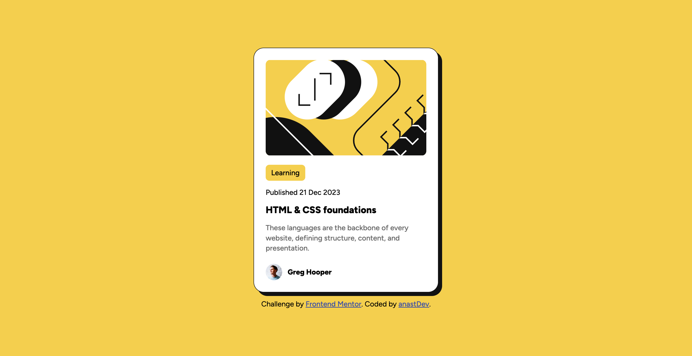

#Frontend Mentor - Blog solution

## Table of contents

- [Overview](#overview)
  - [The challenge](#the-challenge)
  - [Screenshot](#screenshot)
  - [Links](#links)
- [My process](#my-process)
  - [Built with](#built-with)
  - [What I learned](#what-i-learned)
  - [Continued development](#continued-development)
  - [Useful resources](#useful-resources)
- [Author](#author)

## Overview

### The challenge

Users should be able to:

- See hover and focus states for all interactive elements on the page

### Screenshot



### Links

- [Solution URL](https://anastdev.github.io/Blog-Project-FrontendMentor/)
- [Live Site URL]()

## My process

### Built with

- Semantic HTML5 markup
- CSS custom properties
- Flexbox
- Media Query
- Variables
- Bootstrap

### What I learned

In this project, I had the chance to learn new concepts, including the hover effect and the use of "em" and "rem" units.

```
.card-title:hover {
  color: var(--background-color);
}
```

```
.card-title {
  font-size: 1.3em;
  margin-bottom: 1rem;
}
```

In particular, I learned how to implement the hover effect in my code, as well as the differences between "rem" and "em" units and their respective uses. I also used CSS variables to avoid code repetition and to make the styling more cohesive and maintainable.

Moving forward, I plan to continue focusing on refining these skills and exploring other techniques to enhance my development process.

### Continued development

The use of "em" and "rem" units was quite useful in this project, and I plan to continue implementing them in future work. However, I’m still not entirely satisfied with my understanding and usage of these units, as I’m not yet fully comfortable with them. My goal is to become more confident and proficient with these techniques in upcoming projects.

### Useful resources

- [Youtube - Slaying The Dragon](https://www.youtube.com/@slayingthedragon) - I found this YouTube channel incredibly helpful for learning CSS Flexbox and Responsive CSS. Each concept was explained clearly and was easy to understand, making it a valuable resource for anyone looking to improve their CSS skills.

- [W3schools](https://www.w3schools.com/css/default.aspm) - On this website, I was able to explore elements and learn how to effectively use them in my code. Very beginner-friendly.

- [Bootstrap](https://getbootstrap.com/docs/4.0/components/card/) - Reviewed the documentation and used it for reference in building the card UI.

## Author

- Frontend Mentor - [@anastDev](https://www.frontendmentor.io/profile/anastDev)
